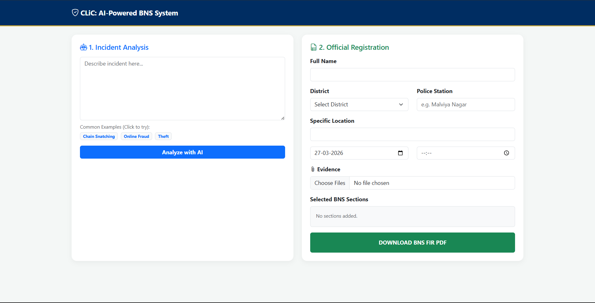
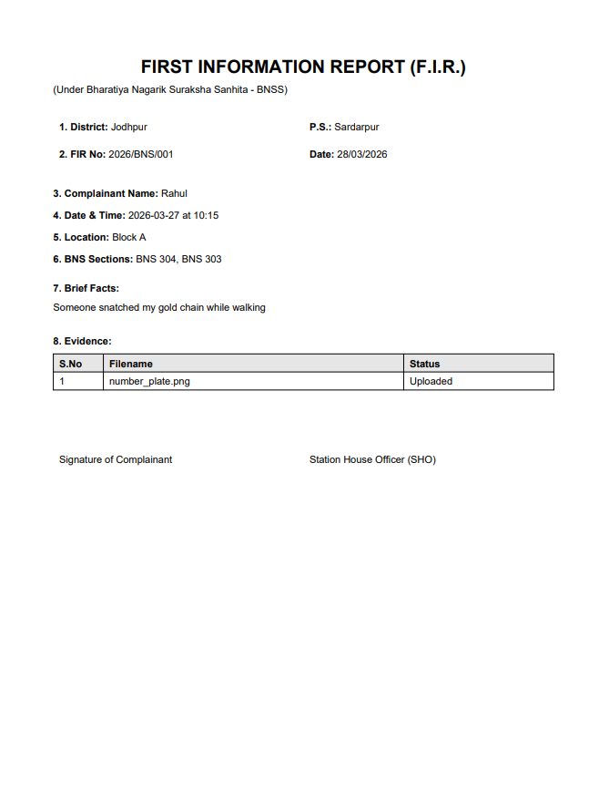

# 🚀 CLiC — AI-Powered Crime Law Informer & FIR Assistant

CLiC (Crime Law Informer Chatbot) is an AI-powered legal-tech system that analyzes user-described incidents and suggests relevant sections from the **Bharatiya Nyaya Sanhita (BNS)**.

It also enables users to generate a structured **FIR (First Information Report) PDF**, making legal understanding and reporting more accessible and user-friendly.

---

## 🔥 Features

* 🧠 AI-powered semantic search using embeddings
* ⚡ Fast and scalable retrieval using FAISS
* 📚 Intelligent BNS section recommendation
* 📄 Automated FIR PDF generation
* 🌐 Interactive web interface (Flask + Bootstrap)
* 🧾 Evidence upload support in FIR

---

## 🧠 How It Works

1. User enters an incident description
2. Text is converted into embeddings using Sentence Transformers
3. FAISS retrieves the most relevant BNS sections
4. Results are ranked using hybrid (semantic + rule-based) approach
5. User selects sections and generates FIR PDF

---

## 🏗️ Project Architecture

```
User Input
    ↓
Embedding Model (MiniLM)
    ↓
FAISS Vector Search
    ↓
Relevant BNS Sections
    ↓
FIR Generation (PDF)
```

---

## 🛠 Tech Stack

* **Backend:** Flask (Python)
* **AI/ML:** Sentence Transformers, FAISS
* **Data Processing:** Pandas, NumPy
* **Frontend:** HTML, Bootstrap
* **PDF Generation:** ReportLab

---

## 📁 Project Structure

```
CLiC/
│
├── app.py
├── search.py
├── build_index.py
│
├── final_ready_dataset.csv
├── final_chunked_dataset.csv
│
├── templates/
│   └── index.html
│
├── requirements.txt
└── README.md

# Generated locally (not included in repo)
# faiss_index.bin
# metadata.pkl
```

---

## 🚀 Installation

```bash
git clone https://github.com/aayu-13/CLiC-AI-Legal-Assistant.git
cd clic-ai-legal-assistant

pip install -r requirements.txt
python app.py
```

---

## ⚙️ Setup (Important)

Before running the app, generate embeddings:

```bash
python build_index.py
```

---

## ▶️ Usage

1. Open browser and go to:
   http://127.0.0.1:5000

2. Enter incident description (e.g., "Someone stole my phone")

3. View suggested BNS sections

4. Select relevant sections

5. Generate FIR PDF

---

## ⚠️ Disclaimer

This system generates a **draft FIR** for assistance purposes only.
It is **not an officially registered FIR** and must be verified by legal authorities.

---

## 🚀 Future Enhancements

* 🤖 LLM-based explanation layer
* 🌍 Multi-language support
* ☁️ Cloud deployment
* 📱 Mobile-friendly UI
* 📊 Improved ranking & legal reasoning

---

## 📸 Demo

### 🔍 AI Section Prediction


### 📄 FIR Generation


---

## 💡 Key Highlights

* Implemented a **Retrieval-Augmented Generation (RAG)** based legal assistant using FAISS for efficient semantic search and legal section mapping.
* Combined **semantic search + rule-based ranking**
* Built a complete **end-to-end AI system (ML + Backend + UI + PDF)**

---

## 👨‍💻 Author

**Aayush Mendiratta**
MCA (AI & ML) Student

---

## ⭐ Support

If you found this useful, consider giving it a ⭐ on GitHub!
